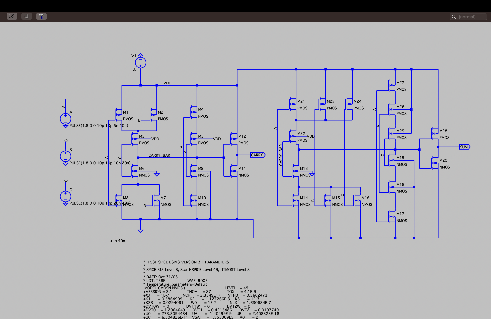

# 28T CMOS Full Adder — Design & Simulation in LTspice

Design and simulation of a 1-bit Full Adder using a 28-transistor CMOS circuit, implemented with TSMC 180nm technology models in LTspice. The design combines pass-transistor logic (PTL) with complementary CMOS logic to reduce transistor count below the conventional 32–36T designs, while preserving correct functionality.

---

## Objective

- Design a Full Adder circuit using only 28 transistors
- Simulate and verify functionality using LTspice
- Use TSMC 180nm CMOS transistor models for realistic device behavior
- Analyze performance in terms of propagation delay, signal integrity, and power
- Apply logic design optimization techniques (pass-transistor logic + CMOS)

---

## Circuit Design

The Sum and Carry logic follow the standard full adder equations:
Sum = A ⊕ B ⊕ Cin
Cout = AB + B·Cin + A·Cin

The 28-transistor implementation breaks down as:
- **Two XOR gates** (transmission-gate based) for the Sum output
- **Multiplexing logic and pass gates** for Carry generation
- **Inverter buffers** for signal restoration, since pass-transistor logic alone degrades signal levels at intermediate nodes

All transistors use TSMC 180nm PMOS4/NMOS4 models at minimum channel length (180nm), with widths chosen to balance speed and area.

---

## Simulation Setup

| Parameter | Value |
|---|---|
| Tool | LTspice XVII |
| Transistor models | TSMC 180nm PDK |
| Supply voltage | 1.8V |
| Load capacitance | 5fF on Sum and Cout |
| Simulation duration | 1600ns (all 8 input combinations) |

Inputs A, B, and Cin were driven with staggered PULSE sources to cycle through every possible input combination.

---

## Results

**Truth table verified via transient simulation:**

| A | B | Cin | Sum | Cout |
|---|---|-----|-----|------|
| 0 | 0 | 0 | 0 | 0 |
| 0 | 0 | 1 | 1 | 0 |
| 0 | 1 | 0 | 1 | 0 |
| 0 | 1 | 1 | 0 | 1 |
| 1 | 0 | 0 | 1 | 0 |
| 1 | 0 | 1 | 0 | 1 |
| 1 | 1 | 0 | 0 | 1 |
| 1 | 1 | 1 | 1 | 1 |

All 8 combinations matched expected logic with no glitches observed.

**Performance:**
- Propagation delay: ~40ns
- Average power consumption: ~15.3µW (1.8V × ~8.5µA)
- Transistor count: 28, vs. 32–36 in conventional CMOS full adders
- Trade-off: intermediate-node noise margin is slightly degraded by pass-transistor logic, restored by output inverters

---

## Files

| File | Description |
|---|---|
| `Implementation_of_Full_adder_using_CMOS.asc` | LTspice schematic/simulation source file |
| `circuit_schematic.png` | Transistor-level circuit diagram |
| `waveform_results.png` | Simulation waveform output |
| `ANALOG_PROJECT.pdf` | Full project report |

---

## References

- TSMC 180nm PDK Documentation
- LTspice Official Manual
- Sung-Mo Kang and Y. Leblebici, *CMOS Digital Integrated Circuit Analysis and Design*

---

## Author

**Chhavi Verma**
ECE |
